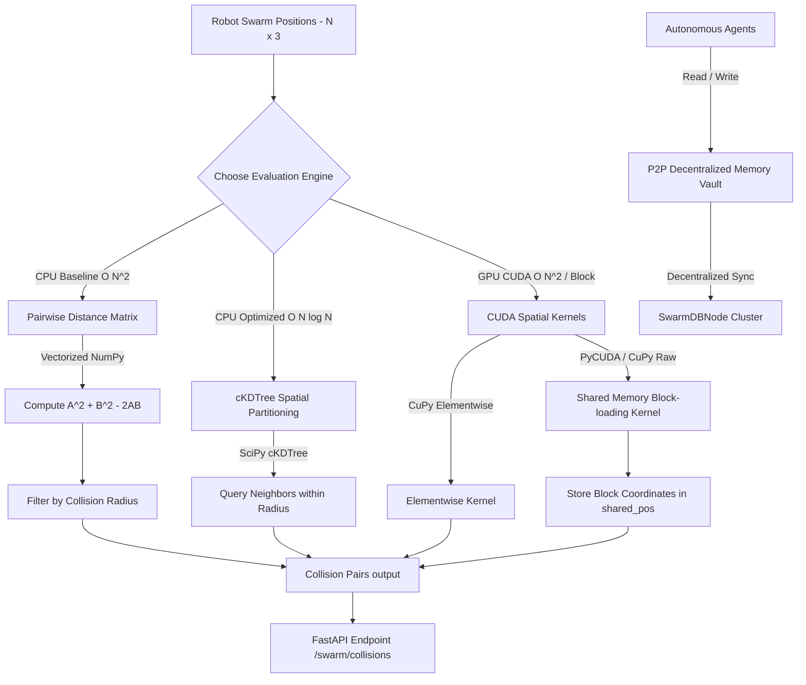

# 🌌 SwarmDB: Massively Parallel Spatial Indexing Engine for Autonomous Systems

<div align="center">


</div>

## 👥 Team Members
1. **Sharvin Mhatre** (ECS Dept., SIES Graduate School of Technology)
2. **Archit Jaijith** (ECS Dept., SIES Graduate School of Technology)
3. **Saumitrya Chavan** (ECS Dept., SIES Graduate School of Technology)

---

## 💡 Why SwarmDB Was Made
In autonomous swarm robotics, verifying the proximity of agents in real-time is vital to prevent collisions and coordinate formations. SwarmDB simulates a dense environment of active robots navigating a 3D coordinate space. 

Calculating pairwise distances for a swarm requires comparing every robot against every other robot. At scale (e.g., $10,000+$ robots), a single computation step requires millions of comparisons, causing severe CPU and memory bottlenecks.

**SwarmDB** was conceptualized for the **NVIDIA CINECA hackathon** to manage and query real-time telemetry data for autonomous robotic swarms using GPU acceleration. It transitions spatial queries from CPU bottlenecks to a high-throughput, parallelized CUDA database engine.

---

## 🏗️ Core Architectural Concepts



### 1. The Kinetic Join Query
The core operation of this database is the **Kinetic Join**: a continuous spatial query that identifies all pairs of robots $(i, j)$ where $i < j$ falling within a specific collision threshold radius $R$:
$$\text{dist}(i, j) \le R$$

### 2. CPU Baseline ($O(N^2)$ Complexity)
Uses NumPy vectorization to perform matrix expansion of the squared Euclidean distance:
$$\|\mathbf{a} - \mathbf{b}\|^2 = \|\mathbf{a}\|^2 + \|\mathbf{b}\|^2 - 2(\mathbf{a} \cdot \mathbf{b})$$
* **Bottleneck**: For $N = 10,000$, a single calculation generates a dense $10,000 \times 10,000$ float matrix containing $100,000,000$ distance values, causing high execution time and Out-Of-Memory (OOM) faults as the swarm scales.

### 3. CPU Optimized ($O(N \log N)$ Complexity)
Leverages SciPy's `cKDTree` to index the 3D space, which allows querying coordinate neighbors within a radius without evaluating the global distance matrix.

### 4. GPU CUDA Acceleration
The project implements two CUDA execution paths to compile and run GPU kernels:
* **Elementwise Kernel**: Maps thread indices directly to matrix coordinate computations to run in parallel.
* **Shared Memory Kernel**: Divides the swarm into chunks of `BLOCK_SIZE` (256). Each block loads its coordinates into fast `__shared__` memory on the GPU Streaming Multiprocessor. This dramatically reduces global PCIe memory bandwidth saturation, allowing high performance spatial joins directly on the GPU.

### 5. Decentralized Agent Memory Layer
Includes a Peer-to-Peer (P2P) database node model (`SwarmDBNode`) where multiple `AutonomousAgent` entities write and read cached states. When an agent updates its local memory node, the node automatically broadcasts the sync update across the cluster. This allows agents to share parameters and bypass redundant computation loops.

---

## ⚙️ Installation & Setup

### Prerequisites
* **Python**: `python 3.9+` (Recommended)
* **CUDA Toolkit**: Required if you plan to run the GPU CUDA acceleration engines.

### 1. Clone & Prepare Virtual Environment
```bash
# Clone the repository
git clone https://github.com/LuxShar007/SwarmDB.git
cd SwarmDB

# Create python virtual environment
python -m venv swarm_env

# Activate virtual environment
# On Windows (Command Prompt)
swarm_env\Scripts\activate.bat
# On Windows (PowerShell)
.\swarm_env\Scripts\Activate.ps1
# On Linux/macOS
source swarm_env/bin/activate
```

### 2. Install Project Dependencies
```bash
pip install -r requirements.txt
```

> [!NOTE]
> If you have a CUDA-compatible GPU, you can install `cupy-cuda12x` (or your matching CUDA version) or `pycuda` to enable the hardware acceleration engines.

---

## 🚀 How to Use

### 1. Run the Benchmarks
To compare performance between the CPU Baseline, CPU Optimized cKDTree, and GPU CUDA (if available) engines, execute:
```bash
python benchmark.py
```

### 2. Start the FastAPI Engine
SwarmDB hosts a web API to run and query the spatial engine remotely.
```bash
uvicorn src.api.main:app --reload
```
Once running, you can access the interactive API docs at [http://127.0.0.1:8000/docs](http://127.0.0.1:8000/docs).

#### Primary API Endpoints
* `POST /swarm/initialize`: Initialise a new swarm of $N$ robots.
* `POST /swarm/update`: Step forward robot coordinate telemetry.
* `GET /swarm/positions`: Fetch current coordinates of all robots.
* `POST /swarm/collisions`: Run Kinetic Join using either `baseline`, `optimized`, or `cuda`.
* `POST /memory/connect`: Link P2P memory nodes.
* `POST /memory/write`: Write cached parameter to a node.
* `POST /memory/read`: Read cached parameter from a node.
* `GET /swarm/benchmark`: Run the benchmark suite through the API.

### 3. Run the P2P Agent Memory Simulation
To run the decentralized multi-agent shared memory synchronization simulation, execute:
```bash
python agent_swarm_memory.py
```

---

## 📊 Expected Benchmark Performance
Depending on your hardware setup, running `benchmark.py` will demonstrate the extreme speedup achieved by the spatial optimizations and CUDA GPU engines:

| Swarm Size (N) | CPU Baseline $O(N^2)$ | CPU Optimized $O(N \log N)$ | GPU CUDA (Shared Mem) |
|---|---|---|---|
| **1,000** | ~0.008 s | ~0.001 s | ~0.001 s |
| **5,000** | ~0.150 s | ~0.003 s | ~0.002 s |
| **10,000** | ~0.700 s | ~0.007 s | ~0.003 s |
| **25,000** | 💥 *High Overhead* | ~0.022 s | ~0.007 s |
| **50,000** | 💥 *OOM Crash* | ~0.048 s | ~0.012 s |
